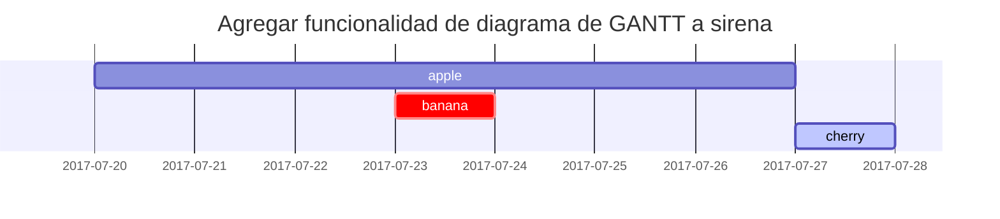

Esta publicación es para mostrar la representación de sintaxis de Markdown en [**ΛLΣJΛПDЯOΛLSΛ**](https://blog.alejandroalsa.es), también puede usarse como ejemplo de escritura. Ahora, comencemos a ver el texto y la tipografía.

## Títulos
---
# H1 - heading

<h2 data-toc-skip>H2 - heading</h2>

<h3 data-toc-skip>H3 - heading</h3>

<h4>H4 - heading</h4>
---

## Párrafo

Quisque egestas convallis ipsum, ut sollicitudin risus tincidunt a. Maecenas interdum malesuada egestas. Duis consectetur porta risus, sit amet vulputate urna facilisis ac. Phasellus semper dui non purus ultrices sodales. Aliquam ante lorem, ornare a feugiat ac, finibus nec mauris. Vivamus ut tristique nisi. Sed vel leo vulputate, efficitur risus non, posuere mi. Nullam tincidunt bibendum rutrum. Proin commodo ornare sapien. Vivamus interdum diam sed sapien blandit, sit amet aliquam risus mattis. Nullam arcu turpis, mollis quis laoreet at, placerat id nibh. Suspendisse venenatis eros eros.

## Listas

### Listas Ordenadas

1. En primer lugar
2. En segundo lugar
3. En tercer lugar

### Listas Desordenadas

- Capítulo
  + Sección
    * Párrafo

### Listas Casilla de Verificación

- [ ] Instrucciones
  + [x] Paso 1
  + [x] Paso 2
  + [ ] Paso 3

### Lista de descripciones

Sol
: El Sol ​ es una estrella de tipo-G de la secuencia principal y clase de luminosidad V

Luna
: La Luna es el único satélite natural de la Tierra. Con un diámetro ecuatorial de 3474.8 km

### Comentarios Visibles

> Esta línea muestra la _cita en bloque_.

## Alertas

> Un ejemplo que muestra el indicador de tipo `consejo`.
{: .prompt-tip }

> Un ejemplo que muestra el indicador de tipo `info`.
{: .prompt-info }

> Un ejemplo que muestra el indicador de tipo `advertencia`.
{: .prompt-warning }

> Un ejemplo que muestra el indicador de tipo `peligro`.
{: .prompt-danger }

## Tablas

| Compañía                     | Contacto         | País    |
|:-----------------------------|:-----------------|--------:|
| DIWES                        | Alejandro Alfaro | España  |
| Space X                      | Elon Musk        | EE.UU   |
| Amazon                       | Jeff Bezos       | EE.UU   |

## Links

<http://127.0.0.1:4000>

## Notas

Haga clic en el gancho para ubicar la nota al pie de página[^footnote], y aquí hay otra nota al pie de página[^fn-nth-2].

## Línea de Código

Este es un ejemplo de `Código en línea`.

## Ruta de archivo

Aquí está `/path/to/the/file.extend`{: .filepath}.

## Bloque de Códigos

### Común

```
Este es un fragmento de código común, sin resaltado de sintaxis ni número de línea.
```

### Lenguaje Específico

```bash
if [ $? -ne 0 ]; then
  echo "El comando no tuvo éxito.";
    #hacer lo necesario / salir
fi;
```

### Nombre de Archivo Específico

```sass
@import
  "colors/light-typography",
  "colors/dark-typography"
```
{: file='_sass/jekyll-theme-chirpy.scss'}

## Matemáticas

Las matemáticas impulsadas por [**MathJax**](https://www.mathjax.org/):

$$ \sum_{n=1}^\infty 1/n^2 = \frac{\pi^2}{6} $$

Cuando $a \ne 0$, hay dos soluciones para $ax^2 + bx + c = 0$ y son

$$ x = {-b \pm \sqrt{b^2-4ac} \over 2a} $$

## SVG



## Imágenes

### Predeterminado (con título)

{: width="972" height="589" }
_Full screen width and center alignment_

### Alineado a la Izquierda

{: width="972" height="589" .w-75 .normal}

### Flotando a la Izquierda

{: width="972" height="589" .w-50 .left}
Praesent maximus aliquam sapien. Sed vel neque in dolor pulvinar auctor. Maecenas pharetra, sem sit amet interdum posuere, tellus lacus eleifend magna, ac lobortis felis ipsum id sapien. Proin ornare rutrum metus, ac convallis diam volutpat sit amet. Phasellus volutpat, elit sit amet tincidunt mollis, felis mi scelerisque mauris, ut facilisis leo magna accumsan sapien. In rutrum vehicula nisl eget tempor. Nullam maximus ullamcorper libero non maximus. Integer ultricies velit id convallis varius. Praesent eu nisl eu urna finibus ultrices id nec ex. Mauris ac mattis quam. Fusce aliquam est nec sapien bibendum, vitae malesuada ligula condimentum.

### Flotando a la Derecha

{: width="972" height="589" .w-50 .right}
Praesent maximus aliquam sapien. Sed vel neque in dolor pulvinar auctor. Maecenas pharetra, sem sit amet interdum posuere, tellus lacus eleifend magna, ac lobortis felis ipsum id sapien. Proin ornare rutrum metus, ac convallis diam volutpat sit amet. Phasellus volutpat, elit sit amet tincidunt mollis, felis mi scelerisque mauris, ut facilisis leo magna accumsan sapien. In rutrum vehicula nisl eget tempor. Nullam maximus ullamcorper libero non maximus. Integer ultricies velit id convallis varius. Praesent eu nisl eu urna finibus ultrices id nec ex. Mauris ac mattis quam. Fusce aliquam est nec sapien bibendum, vitae malesuada ligula condimentum.

### Modo oscuro/claro y sombra

La imagen a continuación alternará el modo oscuro/claro según la preferencia del tema, observe que tiene sombras.

{: .light .w-75 .shadow .rounded-10 w='1212' h='668' }
{: .dark .w-75 .shadow .rounded-10 w='1212' h='668' }

## Video



## Nota al pie inversa

[^footnote]: La fuente de la nota al pie
[^fn-nth-2]: La fuente de la segunda nota al pie
